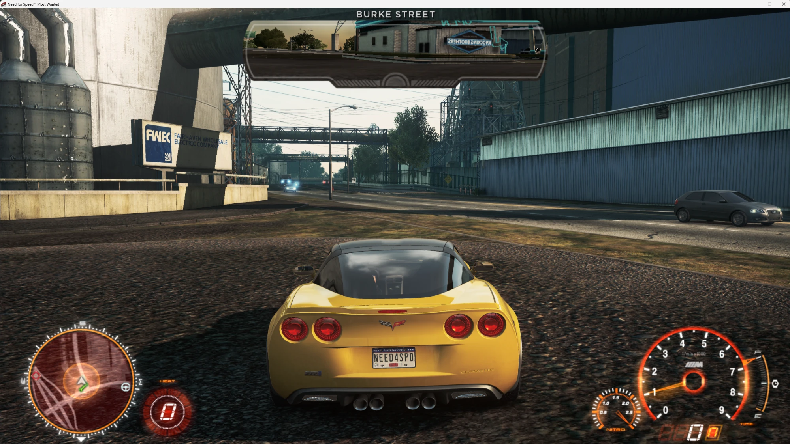

# NFS Most Wanted (2012) – PS3 prototype HUD port

Ports the HUD of the November 2011 PS3 development build (`NPXX00207`, BuildLabel
`2011-11-24-0920_231597_8676`) into the retail PC version of Need for Speed: Most Wanted (2012),
purely at data level (no exe patch).



> **This repository contains no game files.** Every bundle, texture and text resource is generated from
> your own copies: you need the PS3 prototype (`NPXX00207`, e.g. running in RPCS3) and the retail PC game.
> A ready-built file is attached to the [releases](../../releases).

## Requirements

- Python 3.10+, `pip install -r requirements.txt` (numpy, Pillow)
- game locations: edit `tools/paths.py`, or set the environment variables
  `NFSMW_PS3_ROOT` (the `USRDIR\HAWAII_MAIN` folder) and `NFSMW_PC_ROOT` (the PC game folder)

## Usage

```bat
cd tools
python index.py ps3 pc      :: once: build the resource index (cache/)
python build_hud.py         :: produce out\UI\SCREENS2\371621.BNDL
python install.py           :: install (the original file is backed up to backup\)
python install.py --restore :: restore the original
```

Preview renderer: `python render.py <bundle> <image.png> [--pc]`.

## Status (2026-09-25)

- **Works in game** (offline): `python build_hud.py` → `out\UI\SCREENS2\371621.BNDL` (without the two
  extra widgets). Tested: `roundtrip` OK, `tacho-only` OK, release build OK.
- Experimental: `--variant damage-only | speedo-only | with-widgets` (DamageLights damage indicators,
  SpeedoImages per-car dial).
- **The base game also crashes in online mode** (EA app friends list → Origin SDK, `NFS13.exe+0x77da80`),
  independently of the mod: put the EA app into offline mode.

Solved issues: HUD memory budget (prototype RGBA textures re-encoded as BC3, orphaned retail resources
pruned); minimap `UISubImage` NULL pointer (retail sub-images + round mask); unknown data bindings
(`sanitize.py`); DamageLights Lua script → `PlaySequenceFast_ScreenScript`; minimap roads clipped to a
small, offset circle (v1.1: the minimap shader samples its mask with 0..1 UVs, so the mask is now a
generated disc that fills the whole texture).

Releases: **v1.0** first working version · **v1.1** minimap shows the full road network.

## What the build does (free-drive HUD only: `371621` = prototype `FREEDRIVEHUD`)

The retail widget structure is kept (EasyDrive, POI icons, prompts and the recommendation ticker keep
working); the visual HUD is replaced:

| Prototype layout | Content |
|---|---|
| 384049 | round minimap + compass ring |
| 565204 | road name (top centre) |
| 500315 | BMW-style tachometer, speed, gear |
| 500332 | TIME bar |
| 500333 | nitro gauge |
| 581357 | BUSTED/EVADE pursuit arc |
| 390430 | round heat meter |
| 390584, 287202, 457813 | message backing, damage messages, bounty |

Removed on the retail side: layouts of the `Nitrous` widgets (retail speedometer), and from
`AdditionalHUD` 1206246 (minimap frame), 581357 (pursuit bar), 1213038 (heat meter), 1990196 (road name),
plus `MapOverlay`.

Left out: rear-view mirror (its material is missing from retail), weapon counters, HUD sound effects
(PS3 audio format), the `HudSelect` HUD variants.

## Format notes (reverse engineered)

- **bnd2 v5**: 0x70-byte header, 0x48-byte entries, `0x28` = root resource u64 id; entries sorted by
  (stream, id); PC uses chunks 0/1, PS3 chunks 0/2; top 4 bits of the sizes = log2 alignment.
- **Resource id**: `CRC32(lower-case name)`; Genesys objects use `0x01000000_00000000 | GameChanger id`.
- **GenesysType**: 0x1C-byte field descriptors (type import, type hash, count-field pointer, **name hash**,
  size, offset, u16 count, u8 alignment, u8 flags). Flags: 1 = pointer, 8 = array, 16 = polymorphic object
  pointers. Short (≤4 char) field names are stored as ASCII instead of a hash (`Name`, `Tint`, `Mask`).
  Enum: value-name hash + value (`+0x14`). Alignment: byte `0x1F`.
- **GenesysObject writing** (byte-identical to retail): struct → pass 1 in field order: strings, full
  payload of inline sub-structs and of single-pointer structs → pass 2: arrays. Null array = pointer 0;
  allocated-but-empty array = pointer to the current write position.
- **Prototype → retail schema**: the `UIElementBase` base object is gone, its fields were merged into each
  element; X/Y/width/height int → float; enums u16 → u8; layout references UniqueId → Handle.
- **Widget JSON** (`<name>_<id>.json` TextFile, CRC32 of the name): also holds the layout list and the
  data-binding adapters – it must be changed together with the Genesys object.
- **Palette**: retail redefined the shared `HUD_*` colours to blue/white, so the build bakes the
  prototype colours into each element's tint vector.
- **UI renderable**: every UI element is a unit quad; only the material import and the UVs differ.
- **Texture**: DXT data is identical on PS3/PC; A8R8G8B8 is Morton-swizzled on PS3.
